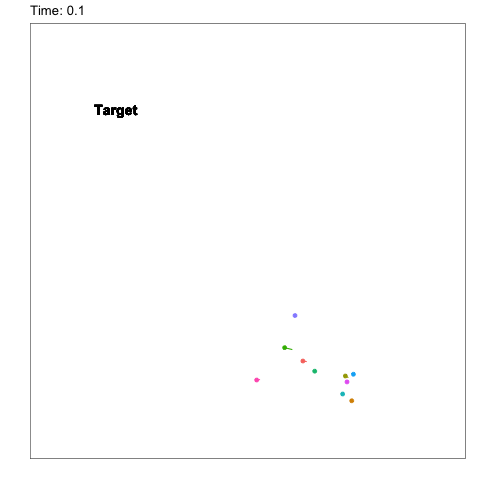
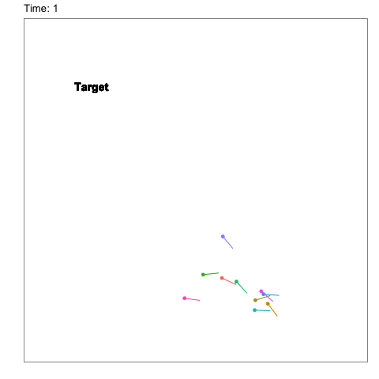
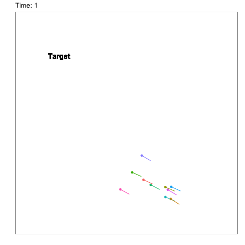

# inverse-irl-guppy

Animations to accompany the following manuscript:

Schafer, T. L., Wikle, C. K., & Hooten, M. B. (2020). Bayesian Inverse Reinforcement Learning for Collective Animal Movement. arXiv preprint arXiv:2009.04003.

Observed trajectories for one all male experiment

Simulated state transitions using probabilitistic transitions induced by the posterior mean of the costs-to-go with initial positions from the observed experiment

Simulated state transitions choosing the least costly state as estimated by the posterior mean of the costs-to-go with initial positions from the observed experiment

